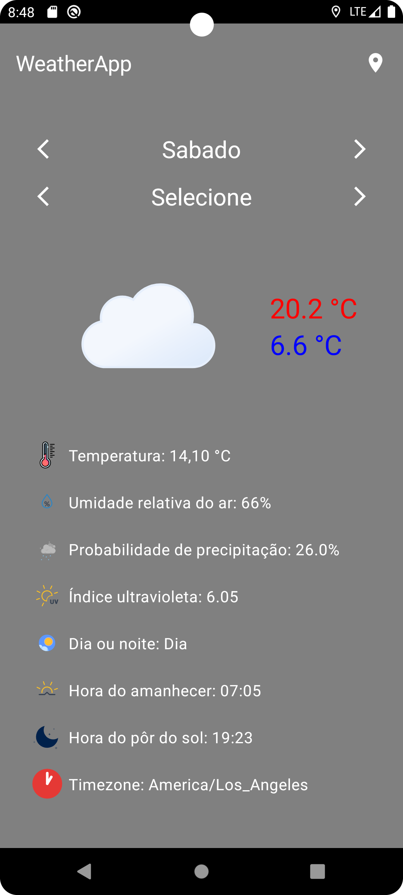

# Oxeanbits Weather app

## [Index](#index)

- [Sobre](#sobre)
- [Funcionalidades](#funcionalidades)
- [Imagens](#imagens)
- [Explicação](#explicação)
- [Bibliotecas](#bibliotecas)
- [API](#api)
- [Como executar os testes](#como-executar-os-testes)
- [Como executar o projeto?](#como-executar-o-projeto)

## [Sobre](#index)

Projeto teste para a vaga de Desenvolvedor Android Nativo na empresa [Oxeanbits](https://www.oxeanbits.com/).

## [Funcionalidades](#index)

### Obrigatórias

✔️ O usuário deverá ser capaz de ver informações metereológicas sobre sua localização geográfica atual.

✔️ Informações como latitude, longitude e timezone deverão ser a princípio fornecidas automaticamente pelo dispositivo.

✔️ Ao abrir a aplicação, as seguintes informações deverão ser apresentadas de acordo com o dia e hora atuais: temperatura, umidade relativa do ar, probabilidade de precipitação, índice ultravioleta, se é dia ou noite, hora do amanhecer e pôr do sol.

✔️ O usuário poderá navegar pelos dias da semana atual e pelas horas do dia. Os dados deverão ser atualizados de acordo com esses dias e horas escolhidos.

✔️ O layout deverá reagir de acordo com os dados. Por exemplo, tons acizentados ou imagens de chuva em dias chuvosos, cores escuras quando noite, cores que remetam a dias ensolarados, etc.

✔️ O usuário poderá trocar a localização geográfica informando latitude e longitude.

✔️ O usuário poderá selecionar em uma lista qualquer uma das 26 capitais brasileiras (+ Brasília).

### Opcionais

✔️ Modo offline.

✔️ Implementação de testes unitários utilizando JUnit, e Roboletric

## [Imagens](#index)

  
  

## [Explicação](#index)

- O aplicativo possui dois seletores na tela principal: um que percorre os dias da semana e outro que percorre os horários do dia.
- Existe um botão de recarregar para restaurar as condições iniciais da aplicação.
- Há também um botão de localização que abre uma bottom sheet para filtrar de acordo com a localização aproximada das capitais brasileiras ou com uma localização de escolha. Ao escolher uma capital, seu nome é exibido na barra superior. Caso a localização não seja definida, aparecerá "WeatherApp" na barra superior.
- Todos os dados visitados são salvos em um banco de dados local para que, em caso de ausência de internet, ainda seja possível verificar as datas de locais já anteriormente visitados.
- Durante o carregamento completo dos dados e a salvamento dos mesmos, os seletores de dias e horários permanecerão bloqueados para evitar a duplicação de dados no banco de dados local.

## [Bibliotecas](#index)

- [Lottie](https://github.com/airbnb/lottie)
- [Retrofit](https://github.com/square/retrofit)
- [Koin](https://insert-koin.io/)
- [Room](https://developer.android.com/training/data-storage/room?hl=pt-br)
- [Robolectric](https://github.com/robolectric/robolectric)
- [MockWebServer](https://github.com/square/okhttp/tree/master/mockwebserver)
- [Mockk](https://mockk.io/)

## [API](#index)

Usamos no projeto o [Open Meteo](https://open-meteo.com/)

## [Como executar os testes](#index)

Para executar os testes, vá até a raiz do projeto e digite no console ./run_test.sh

## [Como executar o projeto?](#index)

Para executar o projeto você percisará:

- Fazer o download do repositório e executar no android studio,
ou na sua IDE de preferência. 
- Adicionar ao seu arquivo de local.properties a linha "API_LINK = https://api.open-meteo.com/".
